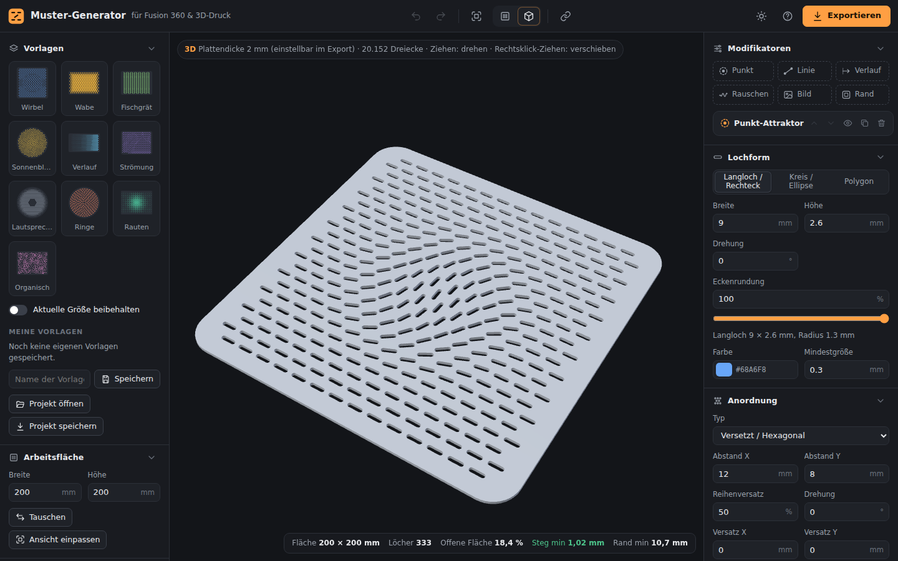

# Muster-Generator

Parametrischer Generator für **Lochmuster und Oberflächen-Relief** – Lüftungsschlitze, Waben, Lautsprechergitter, Verläufe, Griffrillen, Kühlrippen, Noppen – auf Platten oder **rundherum auf Zylindern**, als einfache Web-App, die direkt auf GitHub Pages läuft. Gemacht für den Weg nach **Autodesk Fusion 360** und in den **3D-Druck**: Export als DXF-Skizze, STEP-Körper, Fusion-360-Skript, SVG, STL und PNG.


**Online:** <https://flog93.github.io/3D-Druck/MusterGenerator/> – Teil der [3D-Druck-Werkzeuge](../README.md).

## Funktionen

- **Lochformen:** Langloch/Rechteck mit stufenloser Eckenrundung, Kreis/Ellipse, Polygon (3–64 Ecken, z. B. Sechseck-Waben), gerundete Polygone.
- **Anordnungen:** Raster, versetzt/hexagonal, Ringe (tangential/radial ausgerichtet), Sonnenblumen-Spirale, zufällig (Poisson-Disk), QR-Code, Bild/Logo (Pixel). Drehung, Versatz und „Reihen-Drehung“ (abwechselnd ±, z. B. Fischgrät, oder fortlaufend).
- **Modifikatoren** (wie „Gradient Control“), beliebig kombinierbar und in der Reihenfolge verschiebbar:
  - **Punkt-Attraktor** – dreht (addieren, Wirbel, radial), skaliert oder verschiebt Löcher im Radius; optional als **Sperrzone** (z. B. für Schraubendome oder Logos).
  - **Linien-Attraktor** – entlang einer Geraden oder Kurve (Rechtsklick auf die Linie), Löcher „fließen“ entlang der Linie.
  - **Linearer Verlauf**, **Rauschen** (weich oder zufällig, Ausdünnen, Positions-Jitter), **Bildvorlage** (Helligkeit steuert die Lochgröße → Halbton-Muster), **Randverlauf**.
- **Begrenzung:** Rechteck mit Eckenradius, Ellipse/Kreis, Polygon; **Randabstand**; Löcher ganz innen oder mit Mitte innen.
- **Zylinder (Wickel-Modus):** Durchmesser eingeben – die Arbeitsfläche ist die Abwicklung (Breite = π × Ø). Raster rasten auf eine ganze Spaltenzahl ein, Zufallsmuster, Attraktoren und Rauschen wirken über die Naht hinweg, Formen auf der Naht laufen korrekt herum. 3D-Vorschau und STL zeigen das geschlossene Rohr – optional mit **Boden** (Becher, Stifthalter). DXF, SVG und Fusion-Skript liefern die Abwicklung für Fusions *Prägen*.
- **QR-Code & Logo:** Text oder Link eingeben – daraus entsteht ein exakter QR-Code (Fehlerkorrektur L–H, Modulgröße, Balken- oder Punkt-Stil) aus erhabenen, vertieften oder ausgeschnittenen Modulen; die Positionsmarken bleiben massiv. Ein geladenes Logo oder Bild wird mit Schwelle und Pixelgröße zum Pixel-Relief. Jeder QR-Export wird in den Tests von einem unabhängigen Decoder gelesen.
- **Rändelung:** Assistent für Kreuz- (Rauten, 30°/45°) und gerade Rändelung aus Teilung, Winkel und Profilwinkel – erhabene Pyramiden bzw. Grate oder vertiefte Spitzen, auf Platten und nahtlos auf Zylindern (Rändelknopf).
- **Körper (3D):** die Formen als **Durchbrüche**, **erhaben** (Rippen, Noppen, Kühlrippen, Kühlstifte) oder **vertieft** (Nuten, Mulden, Prägungen) – mit Plattendicke, Höhe/Tiefe und **Flankenwinkel** für schräge Wände (45° druckt ohne Stützen; schmale Formen laufen zu Graten, Pyramiden oder Kegeln zu).
- **Direkt im Canvas bearbeiten:** Attraktoren ziehen, Radius per Ring oder Mausrad, Doppelklick setzt einen neuen Attraktor, Zoom/Verschieben, Touch-Bedienung.
- **Prüfung für den 3D-Druck:** Lochanzahl, offene Fläche in %, **schmalster Steg** und kleinster Randabstand. Zu dünne Stege werden orange, Überlappungen rot markiert.
- **3D-Vorschau** der Platte mit Löchern oder Relief (three.js).
- **30 Vorlagen** – Lochmuster: Wirbel, Wabe, Fischgrät, Sonnenblume, Verlauf, Strömung, Lautsprecher, Ringe, Rauten, Organisch, Zahnrad, Fokus, Lamellen, Kristall, Kiesel, Regen, Namensschild; Relief: Griffrillen, Kühlrippen, Kühlstifte, Noppen, Wabenprägung; Zylinder: Stifthalter, Griffhülse, Lampenschirm, Wirbelvase; Rändelung: Rändelknopf, Rändel gerade, Rändelplatte; QR-Schild. Dazu eigene Vorlagen, Projektdateien (JSON), **Teilen-Link**, Rückgängig/Wiederholen, automatisches Speichern im Browser, helles und dunkles Design.



## Weg nach Fusion 360

| Export | Wofür | So geht's in Fusion 360 |
| --- | --- | --- |
| **DXF** (R12, nur Linien/Bögen/Kreise) | Skizze auf einer Fläche – der Standardweg | *Einfügen → DXF einfügen*, Fläche/Ebene wählen, Einheit mm. Dann *Extrusion* → Loch-Profile wählen → *Ausschneiden*. |
| **Fusion-Skript** (JSON + [MusterImport](fusion360/README.md)) | Ein Klick: Skizze **zentriert auf der Fläche** + Schnitt, Vertiefung oder erhabenes Relief | Skript einmalig installieren, ausführen, JSON wählen, Fläche anklicken, Tiefe/Höhe und Flankenwinkel prüfen – fertig. |
| **STEP – Werkzeugkörper** | Je Form ein Volumenkörper | Datei einfügen, über die Platte legen, *Ändern → Kombinieren → Ausschneiden* (Löcher, Vertiefungen) bzw. *Verbinden* (erhaben). |
| **STEP – Platte** | Fertige Platte als Körper – mit Löchern oder Relief | Einfügen und weiterkonstruieren. |
| **STL** | Platte oder Zylinder direkt drucken – auch mit Relief und schrägen Flanken | In den Slicer ziehen. |
| **Zylinder-Abwicklung** (DXF / Fusion-Skript) | Muster auf die Mantelfläche eines Zylinders in Fusion | Skizze auf eine Ebene tangential zur Mantelfläche legen (Skript: Vorgang *Nur Skizze*), dann *Erstellen → Prägen*: Profile + Zylinderfläche wählen, Tiefe/Höhe eintragen. |
| **SVG** / **PNG** | Illustrator, Inkscape, Affinity, Laser / Dokumentation | 1 SVG-Einheit = 1 mm. |

Tipp: Im Generator als **Arbeitsfläche** die Maße der Fläche aus Fusion eintragen (z. B. Deckel 150 × 100 mm) und über **Begrenzung** + **Randabstand** den Rand freihalten. Der Ursprung (0,0) liegt standardmäßig in der Mustermitte.

Alle Exporte werden automatisch geprüft: DXF mit [ezdxf](https://ezdxf.mozman.at/), STEP mit [OpenCascade](https://dev.opencascade.org/) (jeder Körper gültig, Volumen exakt – auch mit Relief), STL auf Wasserdichtheit und Volumen – auch das gebogene Zylinder-Netz mit Formen über der Naht.

## Lokal starten

Die App ist reines HTML/CSS/JavaScript ohne Build-Schritt. Wegen der ES-Module braucht sie einen kleinen Webserver – im Hauptordner des Repositorys:

```bash
python3 -m http.server 8080   # oder: npm start
# dann http://localhost:8080/MusterGenerator/ öffnen
```

Veröffentlicht wird die App mit der Übersichtsseite über GitHub Pages (siehe [Haupt-README](../README.md#github-pages-einrichten-einmalig)); das Fusion-Skript liegt dort als `fusion/MusterImport.zip` bei.

## Entwicklung

```
MusterGenerator/
  index.html, css/, favicon.svg   Web-App (→ flog93.github.io/3D-Druck/MusterGenerator/)
  js/core/                  Geometrie: Lochformen, Begrenzung, Anordnungen,
                            Modifikatoren, Generator, Stegbreiten-Prüfung, Vorlagen
  js/export/                SVG, DXF, STEP, Fusion-JSON, STL/Mesh, PNG
  js/ui/                    Oberfläche, Canvas, Interaktion, Dialoge, 3D-Vorschau
                            (Design und Bedienelemente aus ../shared/)
  vendor/                   Triangulierung (Delaunator, Constrainautor, earcut), QR-Codes (qrcode-generator)
  fusion360/MusterImport/   Fusion-360-Skript
  tests/                    Tests (Node + Python)
  docs/                     Bilder für diese Anleitung
```

Im Hauptordner des Repositorys:

```bash
npm run test:muster       # JavaScript-Tests + Fusion-Skript-Test (nachgebaute Fusion-API)
npm run validate:muster   # Exporte mit ezdxf/OpenCascade/zxing prüfen (pip install ezdxf cadquery-ocp zxing-cpp pillow)
```

Die Tests laufen bei jedem Push über [GitHub Actions](../.github/workflows/tests.yml).

Fremdbibliotheken und ihre Lizenzen: [`vendor/README.md`](vendor/README.md).
