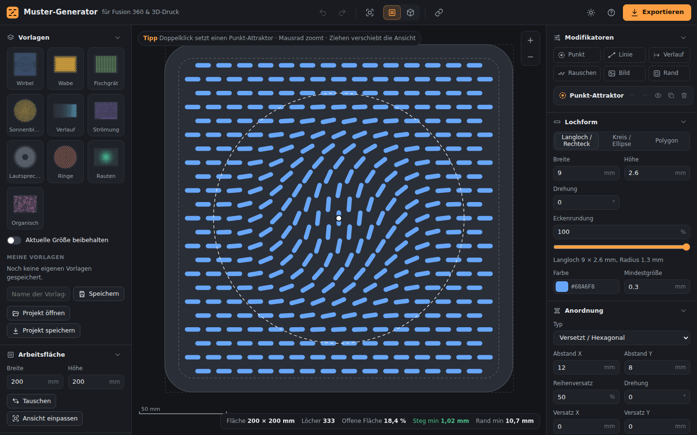

# 3D-Druck-Werkzeuge

Web-Tools, die mühsame Handarbeit beim Konstruieren für den 3D-Druck ersetzen – direkt im Browser, ohne Installation, mit Export nach **Autodesk Fusion 360** und in den Slicer.

**Online:** <https://flog93.github.io/3D-Druck/> – die Übersichtsseite verlinkt alle Werkzeuge.

## Werkzeuge

| Werkzeug | Was es macht | Online | Anleitung |
| --- | --- | --- | --- |
| **Muster-Generator** | Lochmuster, Rippen, Noppen, Rändelungen und QR-Codes – auf Platten oder nahtlos rundherum auf Zylindern. Export als DXF, STEP, STL, SVG, PNG und Fusion-360-Skript. | [Öffnen](https://flog93.github.io/3D-Druck/MusterGenerator/) | [MusterGenerator](MusterGenerator/README.md) |
| **Text-Generator** | Schlüsselanhänger, Namens-, Tür-, WLAN- und Kofferschilder, Münzen, Stempel, Becher und Schablonen: jede Google-Schrift, Symbole, QR-Codes, eigene Grafiken, Rückseite, Text im Bogen oder Kreis, Öse, Schrauben oder Magnete, Schrift erhaben, vertieft, bündig oder als Schablone mit Stegen (große in Puzzle-Teilen). Stempel mit Griff, Stifthalter und Windlichter mit Schrift rundherum. 3MF für Bambu Studio mit AMS-Zuordnung, STL, SVG und STEP für Fusion 360, DXF. | [Öffnen](https://flog93.github.io/3D-Druck/Text-Generator/) | [Text-Generator](Text-Generator/README.md) |

[](https://flog93.github.io/3D-Druck/MusterGenerator/)

## Aufbau

Jedes Werkzeug hat einen eigenen Ordner mit Web-App, Tests, Anleitung und ggf. Fusion-360-Skript:

```
index.html              Übersichtsseite (Startseite auf GitHub Pages)
MusterGenerator/        Muster-Generator
  index.html, css/, js/, vendor/   Web-App
  fusion360/            Fusion-360-Skript (MusterImport)
  tests/                Tests (Node + Python)
  docs/                 Bilder für die Anleitung
  README.md             Anleitung
Text-Generator/         Text-Generator (gleicher Aufbau, Schriften in fonts/)
shared/                 Gemeinsamer Code: Design, Bedienelemente, Symbole, Triangulierung (→ shared/README.md)
.github/workflows/      Tests (tests.yml) und Veröffentlichung (pages.yml)
package.json            npm start / npm test
```

Veröffentlicht wird nach festen Regeln ([`pages.yml`](.github/workflows/pages.yml)):

- `index.html` im Hauptordner → <https://flog93.github.io/3D-Druck/>
- jeder Ordner mit einer `index.html` → `https://flog93.github.io/3D-Druck/<Ordner>/`
- `shared/` → `https://flog93.github.io/3D-Druck/shared/` (von den Werkzeugen per relativem Pfad eingebunden)
- `tests/`, `docs/`, `fusion360/` und `README.md` eines Werkzeugs kommen nicht auf die Seite; jedes Skript in `fusion360/<Name>/` liegt dort als `fusion/<Name>.zip` zum Herunterladen.

### Neues Werkzeug hinzufügen

1. Ordner anlegen, z. B. `Neues-Werkzeug/`, mit einer `index.html` (reines HTML/CSS/JavaScript, nur relative Pfade). Design und Bedienelemente kommen aus `shared/` (`../shared/css/ui.css`, `../../shared/js/controls.js` …).
2. Auf der Übersichtsseite (`index.html`) eine Karte ergänzen.
3. Tests in `Neues-Werkzeug/tests/` ablegen und in [`tests.yml`](.github/workflows/tests.yml) und `package.json` eintragen.
4. Alle Werkzeuge teilen sich den Browser-Speicher: eigene Schlüssel mit dem Werkzeugnamen beginnen (z. B. `text-generator.…`). Hell/Dunkel steht für alle in `3d-druck.theme`.

## GitHub Pages einrichten (einmalig)

1. Im Repository **Settings → Pages** öffnen.
2. Unter **Build and deployment → Source** den Eintrag **GitHub Actions** wählen.
3. Der Workflow veröffentlicht danach die Übersicht und alle Werkzeuge bei jedem Push auf den Standard-Branch (oder manuell über *Actions → GitHub Pages → Run workflow*).

## Lokal starten und testen

Alles ist reines HTML/CSS/JavaScript ohne Build-Schritt. Wegen der ES-Module braucht es einen kleinen Webserver:

```bash
python3 -m http.server 8080   # oder: npm start
# Übersicht: http://localhost:8080/   Muster-Generator: http://localhost:8080/MusterGenerator/

npm test                      # Tests aller Werkzeuge
```

Die Tests laufen außerdem bei jedem Push über [GitHub Actions](.github/workflows/tests.yml).
