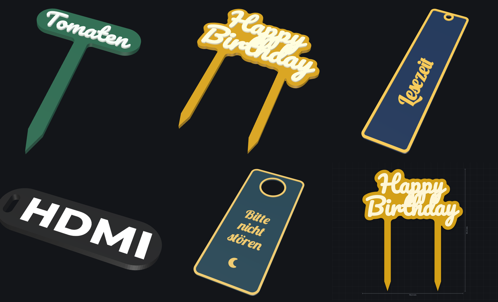
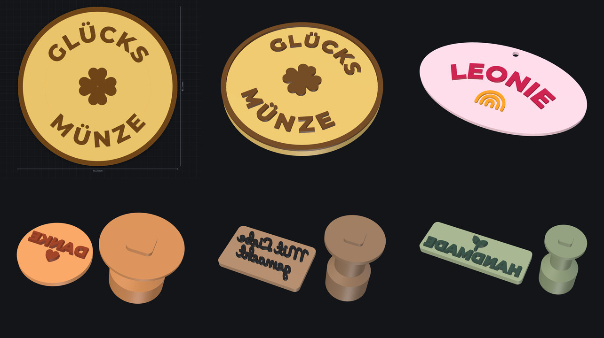

# Text-Generator

Schlüsselanhänger, Namens-, Tür-, WLAN- und Kofferschilder, **Münzen**, **Stempel**, **Becher und Stifthalter** und **Schablonen** für den 3D-Druck – direkt im Browser. Jede Google-Schrift, Symbole wie ♥ ⭐ 🐾, **QR-Codes** (auch fürs WLAN), **eigene Grafiken** (SVG) und Beschriftung auf der **Rückseite**; Text gerade, im **Bogen** oder **im Kreis**; Platte als Kontur um die Schrift oder als Rechteck, Kapsel, Oval oder Kreis, mit Öse, Loch, Schlitz, Schraublöchern mit Senkung oder Magnet-Taschen, Rand und Kontur – Schrift **erhaben**, **vertieft**, **bündig eingelegt** oder als **Schablone** ausgeschnitten, mit automatischen Stegen und, wenn sie größer als das Druckbett ist, in Teilen mit **Puzzle-Verbindern**. **Stempel** für Tinte, Kekse und Ton bekommen gespiegelte Schrift, schräge Flanken und einen Griff zum Aufstecken, **Becher** die Schrift rundherum – auch als Windlicht. Die 3MF-Datei bringt Platte, Schrift, Kontur und Rand als eigene Teile mit fester Filament-Nummer mit – in **Bambu Studio** (AMS) nur noch Farben wählen und drucken. Für **Fusion 360** gibt es SVG mit glatten Kurven und STEP mit einem Körper je Teil, für Laser und Schneideplotter SVG und DXF.


**Online:** <https://flog93.github.io/3D-Druck/Text-Generator/> – Teil der [3D-Druck-Werkzeuge](../README.md).

## Funktionen

- **Text:** mehrzeilig, beliebig viele Textblöcke mit eigener Schrift, Größe (Höhe der Großbuchstaben in mm), Zeichen- und Zeilenabstand, Ausrichtung, Position und Drehung. Texte lassen sich in der Vorschau mit der Maus verschieben.
- **Bogen und Kreis:** Jeder Text läuft gerade, im **Bogen** (Biegung in Grad, nach oben oder unten gewölbt) oder auf einem **Kreis** – oben oder unten, der untere von links nach rechts lesbar. Für Münzen und Siegel zwei Texte mit derselben Mitte und demselben Radius.
- **QR-Codes:** als Link oder Text – oder als **WLAN-Zugang** (Netzname, Passwort, Verschlüsselung): Handy-Kamera drauf, schon ist man im Netz. Größe in mm, Fehlerkorrektur L–H, heller Rand um den Code, Module als Quadrate oder **runde Punkte** (die Positionsmarken bleiben massiv) und ein **Logo in der Mitte** – ein Symbol aus der Auswahl oder eine eigene SVG (dann automatisch Fehlerkorrektur H). Warnungen bei Modulen unter 1 mm, zu wenig Kontrast oder wenn etwas in den Code ragt. Jeder Export-Test liest die QR-Codes mit [zxing-cpp](https://github.com/zxing-cpp/zxing-cpp) zurück.
- **Eigene Grafiken (SVG):** Logos und Icons aus SVG-Dateien – Pfade (auch Bögen), Rechtecke, Kreise, Ellipsen, Polygone, Gruppen mit Transformationen, `<use>`, CSS-Klassen, Füllregeln und **Linien** (z. B. Icons aus Lucide oder Feather). Dunkle Flächen werden gedruckt, weiße darauf sparen aus; „Hell und dunkel tauschen“ für helle Grafiken auf dunklem Grund. Größe, Fettung, Position, Drehung und eigene Farbe wie beim Text.
- **Rückseite:** Jeder Block kann auf die Rückseite (z. B. Telefonnummer auf der Hundemarke) – gespiegelt in den Boden eingelegt, **farbig** in den ersten Schichten (glatt, vom Druckbett) oder **vertieft**. Die Vorschau zeigt beide Seiten, Magnet-Taschen weichen dem Inhalt der Rückseite aus.
- **Symbole:** 66 flächige, gut druckbare Symbole eingebaut (Herz, Stern, Pfote, Hund, Katze, Pferd, Kleeblatt, Sonne, Schneeflocke, Fußball, Note, Krone, Haus, Anker, Auto, Traktor, WLAN …) über den Knopf *♥ Symbol* – ab 10 mm Höhe ohne zu dünne Linien. Eingefügte Emoji wie 🐕 oder ❤ nutzen dieselben Symbole; alle anderen Emoji kommen als Strichzeichnung aus Noto Emoji (lädt bei Bedarf). Symbole werden so hoch wie die Großbuchstaben gesetzt.
- **Schriften:** sechs eingebaut (Montserrat, Pacifico, Lobster, Roboto, Bebas Neue, Black Ops One – funktionieren offline), dazu **alle Google Fonts** mit Suche, Kategorien, Live-Vorschau und Auswahl der Strichstärke. **Fettung** macht dünne Schriften druckbar (Striche dicker oder dünner in mm).
- **Grundform:** Kontur (folgt der Schrift, getrennte Wörter werden automatisch verbunden), Rechteck mit Eckenradius, Kapsel, Oval, Kreis – automatisch um die Schrift oder mit festen Maßen –, **Becher** (siehe unten) oder ganz ohne Platte (nur Buchstaben).
- **Befestigung:** Öse außen, Loch in der Platte oder **Schlitz** für Band, Lanyard oder Clip – links, rechts oder oben; **zwei Schraublöcher** mit 90°-**Senkung** für Senkkopfschrauben (Kopf-Ø einstellbar). Bei der Kontur werden Laschen angesetzt, die Übergänge verrundet. Oder ein **Stecker** unten – einer in der Mitte oder zwei, mit Spitze und verrundetem Übergang – für Pflanzenstecker und Tortenaufsätze.
- **Magnet-Taschen** auf der Rückseite zum Einkleben (Anzahl, Ø, Tiefe; Standard 6,2 × 2,2 mm für 6 × 2-mm-Magnete). Sie werden entlang der Platte verteilt und nie so tief, dass sie die Schrift erreichen.
- **Körper (3D):** Plattendicke, Schrift erhaben (Höhe) oder vertieft (Tiefe, mit Mindestboden), **bündig** als zweifarbiges Inlay mit glatter Oberfläche, Rand und **Kontur um die Schrift** (Sticker-Look in einer dritten Farbe) – erhaben oder bündig –, als **Schablone** oder als **Stempel** (siehe unten).
- **Schablonen:** Die Schrift wird aus der Platte geschnitten – zum Sprühen, Lackieren oder Airbrushen. **Stege** halten das Innere von O, A, B, 8 … automatisch: einer oder zwei je Insel, senkrecht, waagerecht oder auf dem kürzesten Weg, Breite einstellbar. Zu schmales Material wird markiert. Ist die Schablone größer als das Druckbett, wird sie in **Teile mit Puzzle-Verbindern** (Schwalbenschwanz) zerlegt.
- **Stempel:** gespiegelte Schrift für **Tinte**, **Keks & Fondant** oder **Ton, Seife, Leder** – mit passender Höhe, **schrägen Flanken** und einem **Griff** als eigenem Teil, dessen Zapfen in einer Tasche auf der Rückseite steckt.
- **Becher und Stifthalter:** gerade oder **konisch** (z. B. ein Übertopf), Durchmesser, Höhe und Boden; die Schrift läuft rundherum – erhaben, vertieft, bündig mit Ringen oben und unten oder als **Windlicht** aus der Wand geschnitten.
- **Serie aus einer Namensliste:** Für jeden Namen ein Anhänger – etwa für alle Kinder einer Klasse. Der erste Text wird je Name ersetzt, im 3MF ist jeder Name ein eigenes Objekt, SVG und DXF legen alle auf einen Bogen.
- **Farben & Filamente:** Farbe und AMS-Filament je Teil (Platte, Schrift, Kontur, Rand) – und mit *Eigene Farbe* für jeden Text einzeln.
- **Prüfung für den Druck:** Striche dünner als die Mindest-Strichstärke (Standard 0,8 mm) werden orange markiert – bei Schablonen das Material (Stege, Stellen zwischen Buchstaben); Hinweise bei fehlenden Zeichen, zerfallender Platte, Schrift über dem Rand und wenn das Teil nicht aufs Druckbett passt (A1 mini, A1/P1/X1, H2D).
- **31 Vorlagen:** Schlüsselanhänger, Anhänger Block, Namensschild (mit Clip-Schlitz), Türschild, Kofferanhänger, Bündig 2-farbig, Oval vertieft, Sticker-Look, Hundemarke (Telefonnummer hinten), Kühlschrank-Magnet, Werkstattschild (Schrauben mit Senkung), WLAN-Schild (QR-Code, Magnete), Logo-Schild (Grafik), Glücksmünze (Text im Kreis), Kinderzimmer (Bogen), Tinten-Stempel, Keksstempel, Seifenstempel, Stifthalter, Zahnputzbecher, Übertopf (konisch), Windlicht, Pflanzenstecker, Tortenaufsatz, Lesezeichen, Kabel-Etikett, Türhänger, Sprühschablone, Airbrush-Schablone, Große Schablone (in zwei Teilen), Nur Buchstaben – dazu eigene Vorlagen, Projektdateien (JSON), Teilen-Link, Rückgängig/Wiederholen, automatisches Speichern, hell/dunkel.




## Mehrfarbig drucken mit Bambu Studio (AMS)

Der **3MF-Export** enthält ein Objekt aus mehreren Teilen – *Platte*, *Schrift*, *Kontur*, *Rand*, *Rückseite*, beim Becher *Boden*, und *Text 2*, *QR-Code 3*, *Grafik 4* … für Blöcke mit eigener Farbe – und legt in `Metadata/model_settings.config` fest, welches Filament jedes Teil bekommt (einstellbar unter **Farben & Filamente** und beim Text). Bambu Studio und OrcaSlicer lesen diese Zuordnung auch aus Dateien anderer Programme:

1. In Bambu Studio *Datei → Importieren → 3MF/STL/STEP … importieren* (Strg+I).
2. Das Objekt erscheint mittig auf der Platte, die Teile sind Filament 1, 2, … zugeordnet.
3. Den Filamenten die passenden AMS-Farben zuweisen, slicen, drucken.

Tipp: Dicken als Vielfache der Schichthöhe wählen (z. B. 2,4 mm Platte bei 0,2 mm Schichten) – dann wechselt die Farbe genau zwischen zwei Schichten. **Bündig** ergibt eine glatte Oberfläche mit farbiger Schrift.

**Serie:** Unter *Serie aus Namensliste* eine Liste eintragen, ein Name pro Zeile (mit `|` umbrechen, z. B. „Familie | Müller“). Beim Export ersetzt jeder Name den ersten Text; im 3MF wird jeder Name ein eigenes Objekt mit seinem Namen, in Reihen auf dem Druckbett angeordnet – mit *Anordnen* (Taste A) verteilt Bambu Studio sie bei Bedarf auf mehrere Platten. Hinweise gelten je Name (etwa wenn ein langer Name nicht auf eine feste Platte passt). SVG und DXF legen alle Namen nebeneinander auf einen Bogen, STEP und PNG enthalten nur den Entwurf.

**Druckausrichtung:** Bei flacher Oberseite (Schrift bündig oder ganz ohne Platte) bietet der Export *Schrift unten* an – das Teil wird umgedreht, die Schriftseite liegt auf dem Druckbett und bekommt dessen Oberfläche (glatt oder die Struktur einer Textured-PEI-Platte). Erhabene und vertiefte Schrift wird immer mit der Schrift nach oben gedruckt. Ein Stempel liegt mit der Schrift nach oben, sein Griff kopfüber daneben; ein Becher steht auf seinem Boden – alles ohne Stützen.

## Schablonen

Unter **Körper (3D) → Schrift: Schablone** wird die Schrift aus der Platte ausgeschnitten. Die Plattendicke springt dabei auf 1,2 mm – für PLA und PETG sind 0,8–1,5 mm gut: dünner gibt schärfere Kanten, dicker hält mehr aus.


- **Stege:** Alles, was herausfallen würde (das Innere von O, A, B, D, P, R, 0, 6, 8, 9, & …), bekommt Stege – *zwei* je Insel (oben und unten, stabiler) oder *einen*, *senkrecht*, *waagerecht* oder auf dem *kürzesten* Weg. Ein Steg zwischen zwei Inseln zählt für beide, bei *einem* Steg je Insel wird die kürzeste Verbindung aller Inseln gesucht. In der Vorschau sind die Stege etwas dunkler, Standardbreite 1,2 mm.
- **Material prüfen:** Stege und Stellen zwischen Buchstaben, die schmaler als die Mindest-Strichstärke sind, werden orange markiert. Genug **Randabstand** (10 mm und mehr) hält den Sprühnebel ab.
- **Größer als das Druckbett:** Die Schablone wird in Teile zerlegt, die aufs Druckbett passen (Größe unter *Prüfung*: A1 mini, A1/P1/X1, H2D). Die Nähte laufen möglichst durch die Lücken zwischen Buchstaben und nie durch das Innere eines Buchstabens; jedes Teil hält für sich zusammen – sonst wird ein Teil mehr genommen. **Schwalbenschwanz-Verbinder** sitzen im vollen Material mit Wand rundherum (Größe einstellbar, sie werden bei wenig Platz bis 5 mm kleiner), das **Spiel** (Standard 0,2 mm) lässt die Teile ineinandergleiten. Die Vorschau nummeriert die Teile von links oben, im 3MF ist jedes Teil ein eigenes Objekt – in Bambu Studio mit *Anordnen* auf die Platten verteilen.
- **Laser und Schneideplotter:** *DXF* und *SVG (Umrisse)* enthalten alle Schnittlinien am Stück (Außenkante und Buchstaben mit Stegen) – auch für Schablonenfolie aus dem Schneideplotter.

Tipp: *Black Ops One* ist selbst schon eine Schablonenschrift und braucht keine Stege.

## Bogen, Kreis und Stempel



- **Bogen:** *Form → Bogen* biegt einen Text an seiner Stelle. Die **Biegung** gibt an, wie weit er um den Bogen läuft (in Grad): positiv nach oben gewölbt wie ein Regenbogen, negativ nach unten.
- **Kreis oben und unten:** Der Text sitzt auf einem Kreis um seine Position – die Vorschau zeigt den Kreis gestrichelt mit seiner Mitte. Der **Radius** zählt bis zur Mitte der Großbuchstaben, die Zeichen stehen gleichmäßig verteilt. Für eine Münze oder ein Siegel ein Text *oben*, einer *unten*, beide mit derselben Position und demselben Radius; der untere bleibt von links nach rechts lesbar.
- **Stempel:** *Körper → Stempel* spiegelt die Schrift, damit der Abdruck richtig herum steht, und bietet drei Arten mit passenden Werten:

  | Stempel für | Platte | Schrift | Flanken | Mindest-Strich |
  | --- | --- | --- | --- | --- |
  | Tinte | 3 mm | 1,5 mm erhaben | gerade | 0,8 mm |
  | Keks & Fondant | 4 mm | 2,5 mm erhaben | 10° schräg | 1,5 mm |
  | Ton, Seife, Leder | 4 mm | 2 mm erhaben | 15° schräg | 1,2 mm |

  **Schräge Flanken** machen die Buchstaben zur Platte hin breiter: stabiler, und sie lösen sich leichter aus Teig, Ton oder Seife. Vertiefte Schrift geht auch (für einen erhabenen Abdruck). Im 3MF sind die Flanken feine Stufen (je etwa 0,25 mm hoch), im STEP echte Schrägen – siehe *Weg nach Fusion 360*.
- **Griff:** ein eigenes Objekt im 3MF, kopfüber und ohne Stützen gedruckt, Höhe einstellbar. Sein eckiger Zapfen steckt in einer Tasche auf der Rückseite des Stempels und kann sich nicht drehen; 0,15 mm **Spiel** je Seite machen ihn stramm, ein Tropfen Sekundenkleber sichert ihn. Ohne Griff bleibt die Rückseite glatt, z. B. zum Aufkleben auf einen Holzklotz.
- **Lebensmittel:** PETG oder PLA mit Lebensmittelfreigabe nehmen, vor dem Stempeln mit Mehl bestäuben, nicht in die Spülmaschine. Ton und Seife: den Stempel leicht einölen oder mit Speisestärke bestäuben, Leder vorher anfeuchten.

## Becher und Stifthalter


- **Grundform → Becher:** Außendurchmesser, Höhe und Boden eingeben; die **Wandstärke** steht unter *Körper*. Die 2D-Vorschau zeigt die Wand **abgewickelt** (Umfang × Höhe): Die Mitte ist vorne, links und rechts treffen sich hinten an der Naht, dort bleiben 1,5 mm frei. Wer einen Text nach links oder rechts schiebt, schickt ihn um den Becher herum; was über die Naht ragt, wird abgeschnitten (mit Hinweis).
- **Konisch** (*Wand → Konisch*): Ø unten und Ø oben eingeben – oben weiter wie ein Übertopf oder enger wie ein Lampenschirm. Die Vorschau zeigt die Wand weiter als Rechteck, so breit wie der Umfang auf halber Höhe und so hoch wie die Wand entlang ihrer Schräge; zum weiten Ende hin wird die Schrift auf dem Becher etwas breiter. Rand und Fuß bleiben waagerecht, die Wand behält ihre Stärke. Ab etwa 35° Schräge warnt das Programm.
- **3D und 3MF:** Die flache Wand wird in schmale Streifen geschnitten und um die Achse gebogen; die Naht schließt exakt, die Teile bleiben geschlossene Körper. Der **Boden** ist ein eigenes Teil desselben Objekts und reicht bis in die Mitte der Wand.
- **Schrift:** erhaben, vertieft oder **bündig** in einer zweiten Farbe; der **Rand** wird zu Ringen oben und unten. Als **Schablone** wird ein **Windlicht** daraus – die Schrift ist aus der Wand geschnitten, Stege halten das Innere von O, A und B. Nur ein LED-Teelicht hineinstellen: PLA wird schon bei etwa 60 °C weich.
- **Drucken:** stehend auf dem Boden, ohne Stützen. Wand 2–2,4 mm für Stifthalter und Zahnputzbecher, 1,6 mm für ein Windlicht. Befestigung, Magnete, Rückseite und Stempel entfallen beim Becher.
- **SVG und DXF** enthalten die abgewickelte Wand 1:1 – beim konischen Becher als **Kreisring-Ausschnitt**, der genau um die Wand passt. Das ergibt eine Vorlage für Folie oder Papier.
- **STEP** enthält den Becher als exakte Körper: Wand, Schrift, Kontur und Ringe liegen auf echten Zylinder- bzw. Kegelflächen, waagerechte Kanten der Buchstaben sind Kreisbögen, senkrechte gerade Linien, alle anderen B-Splines (höchstens 0,4 µm von der gebogenen Kurve entfernt). Der Boden reicht bis an die Innenseite der Wand – in Fusion 360 mit *Ändern → Kombinieren* zu einem Körper verbinden.

## Weg nach Fusion 360

Ganz ohne Skript – drei Wege, je nachdem, was entstehen soll:

| Ziel | Export | So geht's in Fusion 360 |
| --- | --- | --- |
| **Schrift auf ein eigenes Teil** (Gehäuse, Deckel, Schild) | **SVG → Nur Schrift** | *Einfügen → SVG einfügen*, die Fläche wählen und die Schrift mit dem Manipulator platzieren – die Größe stimmt ohne Skalieren. Dann *Extrusion*: die Profile der Buchstaben wählen, *Verbinden* für erhabene, *Ausschneiden* für vertiefte Schrift. |
| **Schrift auf Rundungen** (Zylinder, Griff, Becher) | **SVG → Nur Schrift** – beim Becher die abgewickelte Wand | *Konstruieren → Tangentiale Ebene* an die runde Fläche legen und das SVG darauf einfügen, dann *Erstellen → Prägen*: die Profile und die runde Fläche wählen, erhaben oder vertieft, Tiefe eintragen. |
| **Das ganze Teil weiterbauen** | **STEP** | *Datei → Öffnen → Von meinem Computer öffnen* – oder die Datei in den Datenbereich hochladen und per Rechtsklick *In aktuelles Design einfügen*. Jedes Teil (Platte, Schrift, Rand, Kontur, Rückseite, Griff, Puzzle-Teile, beim Becher auch der Boden) ist ein eigenes Bauteil mit Körpern in seiner Farbe, jeder Buchstabe ein Körper. Mit *Ändern → Kombinieren* verbinden oder abziehen. |

- **Glatte Kurven:** SVG und STEP beschreiben die Umrisse mit Linien und kubischen Kurven statt tausender kleiner Striche – höchstens 0,01 mm vom Druckmodell entfernt. Ecken bleiben Ecken, Rundungen fließen ineinander; ein Buchstabe hat wenige Seitenflächen, Senkungen sind echte Kegel, der Griff eines Stempels ist ein Drehkörper.
- **Richtige Größe:** Fusion 360 liest SVG-Dateien mit 96 dpi und übergeht die mm-Angabe. Das SVG ist deshalb in Pixeln mit 96 dpi gezeichnet und trägt zusätzlich Breite und Höhe in mm – Fusion und alle anderen Programme kommen auf dieselbe Größe.
- **Becher** kommen im STEP fertig gebogen an: Wand und Schrift auf echten Zylinder- bzw. Kegelflächen, die Naht hinten geschlossen.
- **Stempel** mit schrägen Flanken kommen mit echten Schrägen: die Flanke einer Geraden ist eine schräge Ebene, die einer Kurve eine Regelfläche, eine Außenecke ein Stück Kegel; an Innenecken schneiden sich die Flanken. Buchstaben, deren Füße zusammenwachsen, bleiben eigene Körper, die sich am Fuß überschneiden – *Ändern → Kombinieren* vereint sie.
- **Grenzen:** Verändert sich ein Buchstabe beim Breiterwerden – ein kleiner Innenraum wächst zu (e, a), eine Innenkurve ist enger als die Schräge –, behält er im STEP die feinen Stufen wie im 3MF. Bei den Vorlagen ist das nicht der Fall.

## Exporte

| Format | Wofür |
| --- | --- |
| **3MF** | Bambu Studio, OrcaSlicer: Teile mit Filament-Zuordnung (mehrfarbig), Schrift oben oder unten; Teile einer großen Schablone und der Griff eines Stempels als eigene Objekte |
| **STL** | jeder Slicer, einfarbig (alle Teile in einer Datei), Schrift oben oder unten |
| **SVG** | Draufsicht 1:1 mit glatten Kurven – *Farbig*, *Umrisse* (Laser, Plotter, Fusion 360) oder *Nur Schrift* (Skizze auf einem eigenen Teil); nur die Vorderseite, beim Becher die abgewickelte Wand |
| **STEP** | Für Fusion 360 und jedes CAD-Programm: je Teil ein Bauteil mit Körpern in seiner Farbe, exakte Kurven (AP214); Becher auf Zylinder- und Kegelflächen |
| **DXF** | Umrisse 1:1 in mm als geschlossene Linienzüge (AutoCAD R12) – je Teil eine Ebene (PLATTE, SCHRIFT, RAND, KONTUR, RUECKSEITE), bei Schablonen alle Schnittlinien auf SCHNITT, beim Becher die abgewickelte Wand; für Laser, Schneideplotter und CAD (*Einfügen → DXF einfügen*) |
| **PNG** | Bild der Draufsicht |

Jede Datei wird automatisch geprüft: Alle Teile sind geschlossene Körper (jede Kante genau zweimal, richtig orientiert), das Volumen stimmt mit der Rechnung überein, die 3MF liest die Referenzbibliothek [lib3mf](https://github.com/3MFConsortium/lib3mf) des 3MF-Konsortiums im strikten Modus ohne Warnung, jede DXF liest und prüft [ezdxf](https://ezdxf.mozman.at/) (geschlossene Linienzüge, Fläche je Ebene nachgerechnet), jede STEP-Datei liest [OpenCascade](https://dev.opencascade.org/) wie ein CAD-Programm (je Teil ein Bauteil mit Namen und Farbe, jeder Körper gültig, Volumen und Schwerpunkt wie im Druckmodell), und jeder QR-Code wird mit 5, 8 und 16 Pixeln pro Modul gerastert und mit zxing-cpp gelesen – auch mit runden Punkten und Logo.

## Lokal starten

Im Hauptordner des Repositorys `python3 -m http.server 8080` (oder `npm start`), dann <http://localhost:8080/Text-Generator/> öffnen.

## Entwicklung

```
Text-Generator/
  index.html, css/, favicon.svg   Web-App (→ flog93.github.io/3D-Druck/Text-Generator/)
  js/core/                  Schriften (opentype.js), Textsatz (auch Bogen und Kreis), QR-Codes und
                            Grafiken (SVG-Import), Geometrie (Clipper), Schablonen (Stege, Puzzle-Teile),
                            Stempel (Griff), Becher (Kegel, Abwicklung), glatte Kurven aus Polygonen,
                            Modell, Vorlagen
  js/export/                Netze (geschlossene Körper, beim Becher um die Achse gebogen),
                            Triangulierung, 3MF, ZIP, STL, SVG, DXF, STEP (exakte Körper,
                            Becher auf Zylinder- und Kegelflächen)
  js/ui/                    Oberfläche, 2D-Ansicht, 3D-Vorschau, Schriftauswahl, Dialoge
                            (Design und Bedienelemente aus ../shared/)
  fonts/                    eingebaute Schriften und Symbole (SIL OFL 1.1)
  tests/tools/              Export-Prüfung, Bau der Symbol-Schrift (build_symbols.py)
  vendor/                   opentype.js, Clipper
  tests/                    Tests (Node) und Export-Prüfung (Python: lib3mf, ezdxf, OpenCascade, zxing)
  docs/                     Bilder für diese Anleitung
```

Im Hauptordner des Repositorys:

```bash
npm run test:text       # JavaScript-Tests
npm run validate:text   # 3MF/STL mit lib3mf, DXF mit ezdxf, STEP mit OpenCascade, QR-Codes mit zxing prüfen
                        # (pip install lib3mf ezdxf zxing-cpp pillow cadquery-ocp)
```

Fremdbibliotheken und Lizenzen: [`vendor/README.md`](vendor/README.md), Schriften: [`fonts/README.md`](fonts/README.md).
