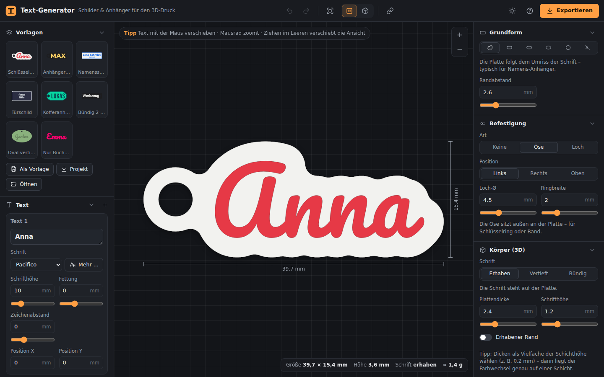
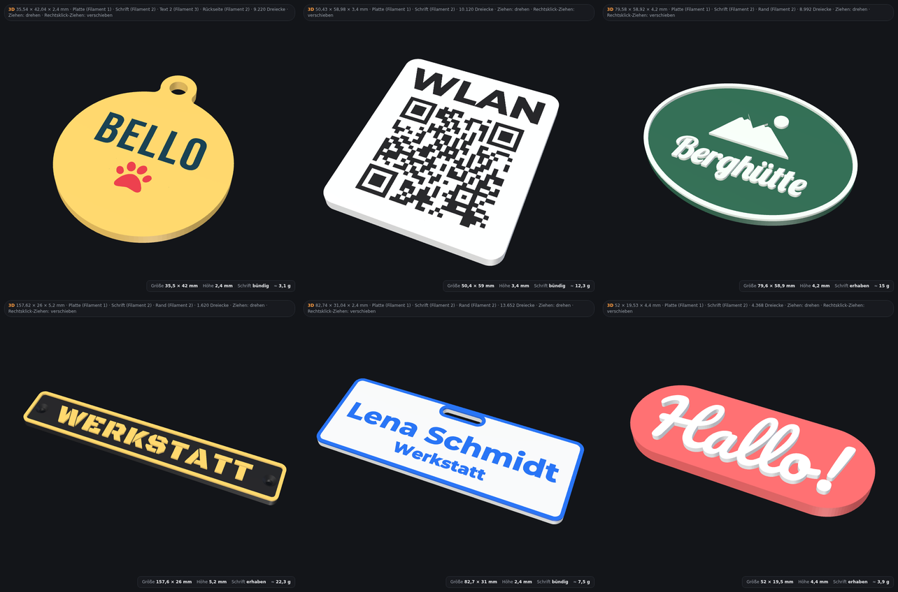
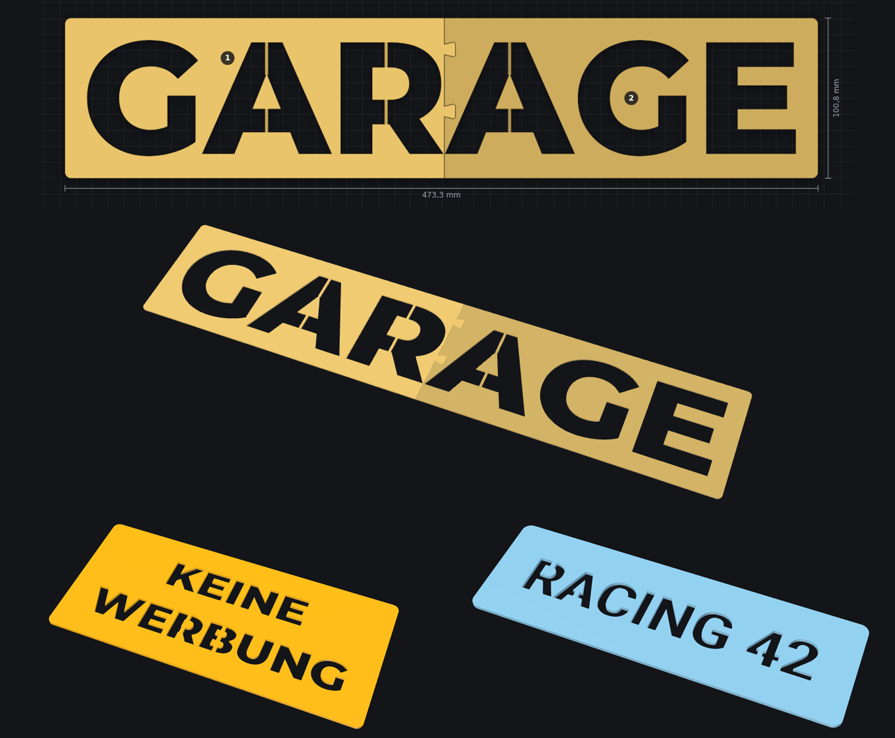

# Text-Generator

Schlüsselanhänger, Namens-, Tür-, WLAN- und Kofferschilder und **Schablonen** für den 3D-Druck – direkt im Browser. Jede Google-Schrift, Symbole wie ♥ ⭐ 🐾, **QR-Codes** (auch fürs WLAN), **eigene Grafiken** (SVG) und Beschriftung auf der **Rückseite**; Platte als Kontur um die Schrift oder als Rechteck, Kapsel, Oval oder Kreis, mit Öse, Loch, Schlitz, Schraublöchern mit Senkung oder Magnet-Taschen, Rand und Kontur – Schrift **erhaben**, **vertieft**, **bündig eingelegt** oder als **Schablone** ausgeschnitten, mit automatischen Stegen und, wenn sie größer als das Druckbett ist, in Teilen mit **Puzzle-Verbindern**. Die 3MF-Datei bringt Platte, Schrift, Kontur und Rand als eigene Teile mit fester Filament-Nummer mit – in **Bambu Studio** (AMS) nur noch Farben wählen und drucken. Für Laser, Schneideplotter und Fusion 360 gibt es SVG und DXF.



**Online:** <https://flog93.github.io/3D-Druck/Text-Generator/> – Teil der [3D-Druck-Werkzeuge](../README.md).

## Funktionen

- **Text:** mehrzeilig, beliebig viele Textblöcke mit eigener Schrift, Größe (Höhe der Großbuchstaben in mm), Zeichen- und Zeilenabstand, Ausrichtung, Position und Drehung. Texte lassen sich in der Vorschau mit der Maus verschieben.
- **QR-Codes:** als Link oder Text – oder als **WLAN-Zugang** (Netzname, Passwort, Verschlüsselung): Handy-Kamera drauf, schon ist man im Netz. Größe in mm, Fehlerkorrektur L–H, heller Rand um den Code, Module als Quadrate oder **runde Punkte** (die Positionsmarken bleiben massiv) und ein **Logo in der Mitte** – ein Symbol aus der Auswahl oder eine eigene SVG (dann automatisch Fehlerkorrektur H). Warnungen bei Modulen unter 1 mm, zu wenig Kontrast oder wenn etwas in den Code ragt. Jeder Export-Test liest die QR-Codes mit [zxing-cpp](https://github.com/zxing-cpp/zxing-cpp) zurück.
- **Eigene Grafiken (SVG):** Logos und Icons aus SVG-Dateien – Pfade (auch Bögen), Rechtecke, Kreise, Ellipsen, Polygone, Gruppen mit Transformationen, `<use>`, CSS-Klassen, Füllregeln und **Linien** (z. B. Icons aus Lucide oder Feather). Dunkle Flächen werden gedruckt, weiße darauf sparen aus; „Hell und dunkel tauschen“ für helle Grafiken auf dunklem Grund. Größe, Fettung, Position, Drehung und eigene Farbe wie beim Text.
- **Rückseite:** Jeder Block kann auf die Rückseite (z. B. Telefonnummer auf der Hundemarke) – gespiegelt in den Boden eingelegt, **farbig** in den ersten Schichten (glatt, vom Druckbett) oder **vertieft**. Die Vorschau zeigt beide Seiten, Magnet-Taschen weichen dem Inhalt der Rückseite aus.
- **Symbole:** 66 flächige, gut druckbare Symbole eingebaut (Herz, Stern, Pfote, Hund, Katze, Pferd, Kleeblatt, Sonne, Schneeflocke, Fußball, Note, Krone, Haus, Anker, Auto, Traktor, WLAN …) über den Knopf *♥ Symbol* – ab 10 mm Höhe ohne zu dünne Linien. Eingefügte Emoji wie 🐕 oder ❤ nutzen dieselben Symbole; alle anderen Emoji kommen als Strichzeichnung aus Noto Emoji (lädt bei Bedarf). Symbole werden so hoch wie die Großbuchstaben gesetzt.
- **Schriften:** sechs eingebaut (Montserrat, Pacifico, Lobster, Roboto, Bebas Neue, Black Ops One – funktionieren offline), dazu **alle Google Fonts** mit Suche, Kategorien, Live-Vorschau und Auswahl der Strichstärke. **Fettung** macht dünne Schriften druckbar (Striche dicker oder dünner in mm).
- **Grundform:** Kontur (folgt der Schrift, getrennte Wörter werden automatisch verbunden), Rechteck mit Eckenradius, Kapsel, Oval, Kreis – automatisch um die Schrift oder mit festen Maßen – oder ganz ohne Platte (nur Buchstaben).
- **Befestigung:** Öse außen, Loch in der Platte oder **Schlitz** für Band, Lanyard oder Clip – links, rechts oder oben; **zwei Schraublöcher** mit 90°-**Senkung** für Senkkopfschrauben (Kopf-Ø einstellbar). Bei der Kontur werden Laschen angesetzt, die Übergänge verrundet.
- **Magnet-Taschen** auf der Rückseite zum Einkleben (Anzahl, Ø, Tiefe; Standard 6,2 × 2,2 mm für 6 × 2-mm-Magnete). Sie werden entlang der Platte verteilt und nie so tief, dass sie die Schrift erreichen.
- **Körper (3D):** Plattendicke, Schrift erhaben (Höhe) oder vertieft (Tiefe, mit Mindestboden), **bündig** als zweifarbiges Inlay mit glatter Oberfläche, Rand und **Kontur um die Schrift** (Sticker-Look in einer dritten Farbe) – erhaben oder bündig – oder als **Schablone** (siehe unten).
- **Schablonen:** Die Schrift wird aus der Platte geschnitten – zum Sprühen, Lackieren oder Airbrushen. **Stege** halten das Innere von O, A, B, 8 … automatisch: einer oder zwei je Insel, senkrecht, waagerecht oder auf dem kürzesten Weg, Breite einstellbar. Zu schmales Material wird markiert. Ist die Schablone größer als das Druckbett, wird sie in **Teile mit Puzzle-Verbindern** (Schwalbenschwanz) zerlegt.
- **Farben & Filamente:** Farbe und AMS-Filament je Teil (Platte, Schrift, Kontur, Rand) – und mit *Eigene Farbe* für jeden Text einzeln.
- **Prüfung für den Druck:** Striche dünner als die Mindest-Strichstärke (Standard 0,8 mm) werden orange markiert – bei Schablonen das Material (Stege, Stellen zwischen Buchstaben); Hinweise bei fehlenden Zeichen, zerfallender Platte, Schrift über dem Rand und wenn das Teil nicht aufs Druckbett passt (A1 mini, A1/P1/X1, H2D).
- **17 Vorlagen:** Schlüsselanhänger, Anhänger Block, Namensschild (mit Clip-Schlitz), Türschild, Kofferanhänger, Bündig 2-farbig, Oval vertieft, Sticker-Look, Hundemarke (Telefonnummer hinten), Kühlschrank-Magnet, Werkstattschild (Schrauben mit Senkung), WLAN-Schild (QR-Code, Magnete), Logo-Schild (Grafik), Sprühschablone, Airbrush-Schablone, Große Schablone (in zwei Teilen), Nur Buchstaben – dazu eigene Vorlagen, Projektdateien (JSON), Teilen-Link, Rückgängig/Wiederholen, automatisches Speichern, hell/dunkel.



## Mehrfarbig drucken mit Bambu Studio (AMS)

Der **3MF-Export** enthält ein Objekt aus mehreren Teilen – *Platte*, *Schrift*, *Kontur*, *Rand*, *Rückseite* und *Text 2*, *QR-Code 3*, *Grafik 4* … für Blöcke mit eigener Farbe – und legt in `Metadata/model_settings.config` fest, welches Filament jedes Teil bekommt (einstellbar unter **Farben & Filamente** und beim Text). Bambu Studio und OrcaSlicer lesen diese Zuordnung auch aus Dateien anderer Programme:

1. In Bambu Studio *Datei → Importieren → 3MF/STL/STEP … importieren* (Strg+I).
2. Das Objekt erscheint mittig auf der Platte, die Teile sind Filament 1, 2, … zugeordnet.
3. Den Filamenten die passenden AMS-Farben zuweisen, slicen, drucken.

Tipp: Dicken als Vielfache der Schichthöhe wählen (z. B. 2,4 mm Platte bei 0,2 mm Schichten) – dann wechselt die Farbe genau zwischen zwei Schichten. **Bündig** ergibt eine glatte Oberfläche mit farbiger Schrift.

**Druckausrichtung:** Bei flacher Oberseite (Schrift bündig oder ganz ohne Platte) bietet der Export *Schrift unten* an – das Teil wird umgedreht, die Schriftseite liegt auf dem Druckbett und bekommt dessen Oberfläche (glatt oder die Struktur einer Textured-PEI-Platte). Erhabene und vertiefte Schrift wird immer mit der Schrift nach oben gedruckt.

## Schablonen

Unter **Körper (3D) → Schrift: Schablone** wird die Schrift aus der Platte ausgeschnitten. Die Plattendicke springt dabei auf 1,2 mm – für PLA und PETG sind 0,8–1,5 mm gut: dünner gibt schärfere Kanten, dicker hält mehr aus.



- **Stege:** Alles, was herausfallen würde (das Innere von O, A, B, D, P, R, 0, 6, 8, 9, & …), bekommt Stege – *zwei* je Insel (oben und unten, stabiler) oder *einen*, *senkrecht*, *waagerecht* oder auf dem *kürzesten* Weg. Ein Steg zwischen zwei Inseln zählt für beide, bei *einem* Steg je Insel wird die kürzeste Verbindung aller Inseln gesucht. In der Vorschau sind die Stege etwas dunkler, Standardbreite 1,2 mm.
- **Material prüfen:** Stege und Stellen zwischen Buchstaben, die schmaler als die Mindest-Strichstärke sind, werden orange markiert. Genug **Randabstand** (10 mm und mehr) hält den Sprühnebel ab.
- **Größer als das Druckbett:** Die Schablone wird in Teile zerlegt, die aufs Druckbett passen (Größe unter *Prüfung*: A1 mini, A1/P1/X1, H2D). Die Nähte laufen möglichst durch die Lücken zwischen Buchstaben und nie durch das Innere eines Buchstabens; jedes Teil hält für sich zusammen – sonst wird ein Teil mehr genommen. **Schwalbenschwanz-Verbinder** sitzen im vollen Material mit Wand rundherum (Größe einstellbar, sie werden bei wenig Platz bis 5 mm kleiner), das **Spiel** (Standard 0,2 mm) lässt die Teile ineinandergleiten. Die Vorschau nummeriert die Teile von links oben, im 3MF ist jedes Teil ein eigenes Objekt – in Bambu Studio mit *Anordnen* auf die Platten verteilen.
- **Laser und Schneideplotter:** *DXF* und *SVG (Umrisse)* enthalten alle Schnittlinien am Stück (Außenkante und Buchstaben mit Stegen) – auch für Schablonenfolie aus dem Schneideplotter.

Tipp: *Black Ops One* ist selbst schon eine Schablonenschrift und braucht keine Stege.

## Exporte

| Format | Wofür |
| --- | --- |
| **3MF** | Bambu Studio, OrcaSlicer: Teile mit Filament-Zuordnung (mehrfarbig), Schrift oben oder unten; Teile einer großen Schablone als eigene Objekte |
| **STL** | jeder Slicer, einfarbig (alle Teile in einer Datei), Schrift oben oder unten |
| **SVG** | Draufsicht 1:1 in mm – farbig oder als Umrisse (Laser, Plotter, Fusion 360); nur die Vorderseite |
| **DXF** | Umrisse 1:1 in mm als geschlossene Linienzüge (AutoCAD R12) – je Teil eine Ebene (PLATTE, SCHRIFT, RAND, KONTUR, RUECKSEITE), bei Schablonen alle Schnittlinien auf SCHNITT; für Laser, Schneideplotter und Fusion 360 (*Einfügen → DXF einfügen*) |
| **PNG** | Bild der Draufsicht |

Jede Datei wird automatisch geprüft: Alle Teile sind geschlossene Körper (jede Kante genau zweimal, richtig orientiert), das Volumen stimmt mit der Rechnung überein, die 3MF liest die Referenzbibliothek [lib3mf](https://github.com/3MFConsortium/lib3mf) des 3MF-Konsortiums im strikten Modus ohne Warnung, jede DXF liest und prüft [ezdxf](https://ezdxf.mozman.at/) (geschlossene Linienzüge, Fläche je Ebene nachgerechnet), und jeder QR-Code wird mit 5, 8 und 16 Pixeln pro Modul gerastert und mit zxing-cpp gelesen – auch mit runden Punkten und Logo.

## In Arbeit

Als Nächstes kommen **Text auf Bögen, Kreisen und Zylindern** (Münzen, Becher, Stifthalter), **Stempel** (gespiegelt) und der Weg nach **Fusion 360** (saubere Skizze und eigenes Skript *TextImport*).

## Lokal starten

Im Hauptordner des Repositorys `python3 -m http.server 8080` (oder `npm start`), dann <http://localhost:8080/Text-Generator/> öffnen.

## Entwicklung

```
Text-Generator/
  index.html, css/, favicon.svg   Web-App (→ flog93.github.io/3D-Druck/Text-Generator/)
  js/core/                  Schriften (opentype.js), Textsatz, QR-Codes und Grafiken (SVG-Import),
                            Geometrie (Clipper), Schablonen (Stege, Puzzle-Teile), Modell, Vorlagen
  js/export/                Netze (geschlossene Körper), Triangulierung, 3MF, ZIP, STL, SVG, DXF
  js/ui/                    Oberfläche, 2D-Ansicht, 3D-Vorschau, Schriftauswahl, Dialoge
                            (Design und Bedienelemente aus ../shared/)
  fonts/                    eingebaute Schriften und Symbole (SIL OFL 1.1)
  tests/tools/              Export-Prüfung, Bau der Symbol-Schrift (build_symbols.py)
  vendor/                   opentype.js, Clipper
  tests/                    Tests (Node) und Export-Prüfung (Python: lib3mf, ezdxf, zxing)
  docs/                     Bilder für diese Anleitung
```

Im Hauptordner des Repositorys:

```bash
npm run test:text       # JavaScript-Tests
npm run validate:text   # 3MF/STL mit lib3mf, DXF mit ezdxf, QR-Codes mit zxing prüfen (pip install lib3mf ezdxf zxing-cpp pillow)
```

Fremdbibliotheken und Lizenzen: [`vendor/README.md`](vendor/README.md), Schriften: [`fonts/README.md`](fonts/README.md).
